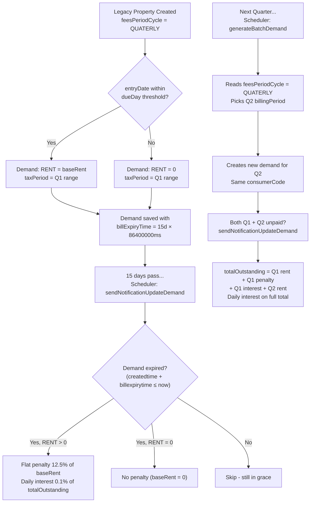

# Rent & Lease Calculator - Development Context & Summary

This document provides a comprehensive overview of the enhancements, refactorings, and configuration changes implemented in the `rl-calculator` service to support robust interest calculations and multi-cycle billing.

---

## 1. Core Changes & Refactorings

### 1.1. Outstanding Dues Daily Interest Refactoring
**Goal**: Calculate daily interest on the total outstanding balance across all unpaid demands for a property, rather than on the base rent of only the current demand.

* **Changes Made**:
  * **Demand Grouping**: Grouped expired unpaid demands by `consumerCode` (representing individual allotments/properties) in `sendNotificationUpdateDemand`.
  * **Total Outstanding Query**: Implemented `getAllUnpaidDemands(tenantId, consumerCode)` in `DemandRepository` to fetch *all* active, unpaid demands (both expired and non-expired) for the property.
  * **Order of Execution Fix**: Moved the flat penalty loop (Step 4) *before* the total outstanding calculation. This ensures any newly added flat penalties are included in the daily interest base on day 0 of expiry.
  * **Dynamic Daily Interest**: Computed `totalOutstanding` dynamically by summing `taxAmount - collectionAmount` across all unpaid demand details. Daily interest is calculated on this cumulative amount and appended to the latest expired demand.
  * **Idempotency & Catch-Up**: 
    * Checked for the presence of `RL_PENALTY_FEE` to ensure the flat penalty is applied only once per demand.
    * Checked the number of existing `RL_DAILYINTEREST` details against the days overdue (`expectedDailyCount = maxDaysOverdue + 1`) to prevent duplicate interest runs and allow the scheduler to catch up correctly if it misses one or more days.

---

### 1.2. Cycle-Aware Legacy Demand Generation
**Goal**: Transition legacy demand generation from a hardcoded `MONTHLY` assumption to supporting all four billing cycles (`MONTHLY`, `QUATERLY`, `BIANNUAL`, `ANNUAL`).

* **Changes Made**:
  * **Method Renaming**: Renamed `generateMonthlyLegacyDemands` to `generateLegacyDemands` (along with its callers in `DemandService`) to reflect cycle-agnostic behavior.
  * **Billing Cycle Extraction**: Read `feesPeriodCycle` from the property's `additionalDetails` JSON node (falling back to `MONTHLY` for backward compatibility).
  * **Dynamic Billing Period Filtering**: Filtered MDMS billing periods matching the extracted cycle.
  * **Zero-Rent Due Date Rule**: Updated the zero-rent rule logic:
    * **Monthly**: Compares current day of month against configured due day: `entryDate.getDayOfMonth() <= configuredDueDay`.
    * **Quarterly/Biannual/Annual**: Compares elapsed days since the start of the tax period against configured due day: `ChronoUnit.DAYS.between(periodStart, entryDate) <= configuredDueDay`.

---

### 1.3. Per-Cycle MDMS Configuration
**Goal**: Allow different due dates and penalty grace periods depending on the billing cycle.

* **MDMS Changes**:
  * Updated [DueDate.json](file:///home/jsb/WorkRepos/punjab-mdms-data/data/pb/testing/rl-services-masters/DueDate.json) with entries for each cycle specifying distinct `dueDay` values (e.g., Monthly = 15, Quarterly = 30, Biannual = 45, Annual = 60).
  * Updated [Penalty.json](file:///home/jsb/WorkRepos/punjab-mdms-data/data/pb/testing/rl-services-masters/Penalty.json) to configure cycle-specific grace periods (`applicableAfterDays`).
* **Java Model Changes**:
  * Added `billingCycle` field to both `DueDate.java` and `Penalty.java` models.
  * Refactored `MasterDataService.getLegacyDueDate` to query and filter the due date by the property's `billingCycle` (falling back to the first available entry or default 10).

---

## 2. Technical Reference

### Billing Cycles Map
| Cycle | Constant | MDMS `billingCycle` | Period Duration | Configured Due Day (MDMS) | Grace Period (MDMS) |
|---|---|---|---|---|---|
| Monthly | `MONTHLY` | `MONTHLY` | 1 Month | 15 days | 15 days |
| Quarterly | `QUATERLY` | `QUATERLY` | 3 Months | 30 days | 30 days |
| Biannual | `BIANNUAL` | `BIANNUAL` | 6 Months | 45 days | 45 days |
| Annual | *(default)* | `ANNUAL` | 12 Months | 60 days | 60 days |

### Database & Tax Head Constants
* `RENT_LEASE_FEE` (`RENT_LEASE_FEE`): Base rent/lease fee.
* `RL_PENALTY_FEE` (`RL_PENALTY_FEE`): One-time flat penalty fee (12.5% of base rent).
* `RL_DAILYINTEREST` (`RL_DAILYINTEREST`): Compounding-alternative daily interest fee (0.1% of total outstanding).

---

## 3. Workflows

### Penalty & Interest Flow Chart

---

## 4. Current Status

The codebase is fully integrated and compiles cleanly.

* **Build Validation**: All changes have been compiled successfully via `mvn clean compile` (BUILD SUCCESS).
* **Git Status**: Changes to `CalculationService.java`, `pom.xml`, and configuration properties are ready to be staged/committed along with `DEVELOPMENT_CONTEXT.md`.

